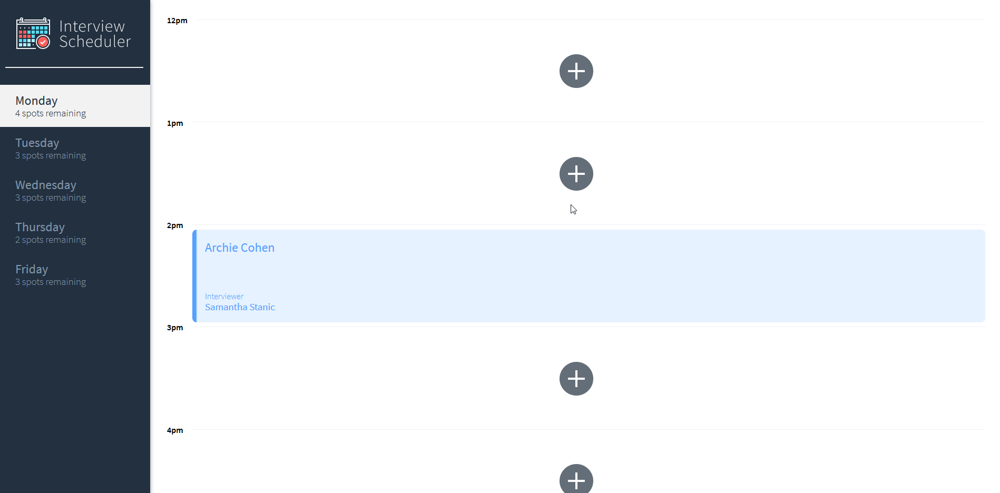
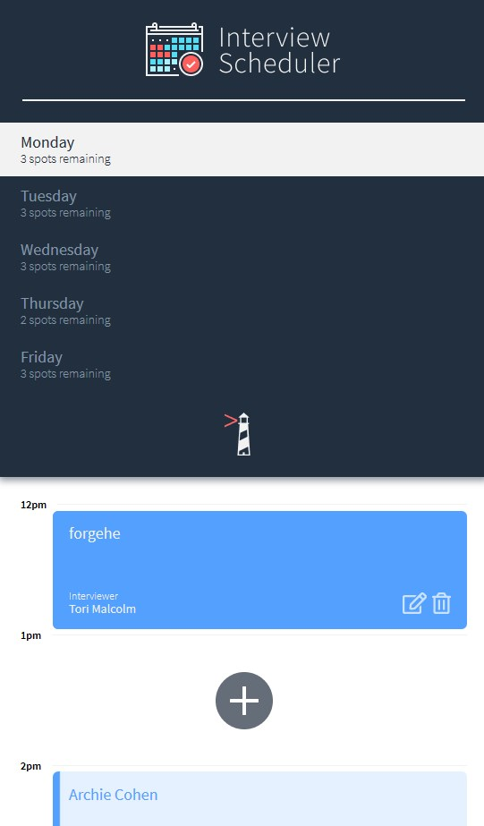

# Interview Scheduler

A SPA interview scheduler made in React to experiment with React components and hooks.



Data is stored in a psql database (setup in another [repo](https://github.com/forgehe/scheduler-api)), and data is sent through via a proxy, using the JSON format.

Testing is done through Jest and and Storybook



## Setup

Install dependencies with `npm install`.

Clone [this repo](https://github.com/forgehe/scheduler-api) and follow the instructions to setup the api server needed to generate and manipulate the data.

## Running Webpack Development Server

```sh
npm start
```

## Running Jest Test Framework

```sh
npm test
```

## Running Storybook Visual Testbed

```sh
npm run storybook
```
